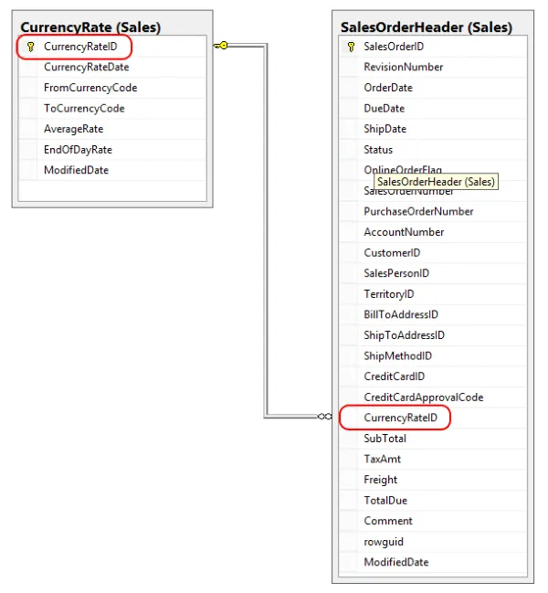
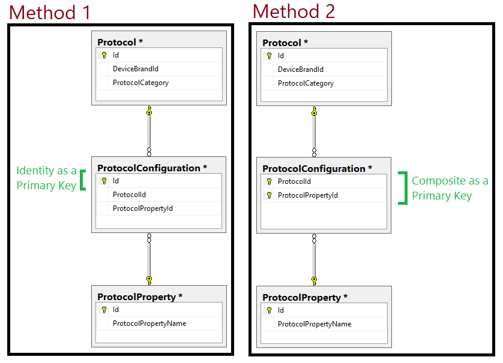

# Week 2.1 SQL

## What is SQL? ##
**SQL** stands for Structured Query Language. 
>
- It is used for managing data in relational database management system which stores data in the form of tables.
- The relationship between data is also stored in the form of tables. 
- SQL statements are used to retrieve and update data in a database
- SQL operates through simple, declarative statements. This keeps data accurate and secure, and it helps maintain the integrity of databases, regardless of size.

**What is a database?**
- An organised repository of data in order to efficiently retrieve data 
- It is held in a computer

**Examples of databases:**
- eCommerce
- Finances
- Customer Bank Accounts
- Sales information

> We must be able to structure tables to contain the right type of information, so that we can query it

**We have to label *raw data* in order to process our data and information efficiently**

---
## Terminology 
- **Column** - Database tables are composed of individual columns corresponding to the attributes of the object
- **Row** - A row consists of one set of attributes corresponding to one instance that a table describes. Also known as Records or Tuples.
- **Table** - A predefined format of rows and columns that define an entity. Also known as a File.
- **Entity** - Anything you want to model in a table
- **DBMS** - A **D**ata **B**ase **M**anagement **S**ystem allows a computer to perform database functions of storing, retrieving, adding, deleting and modifying data.
- **Candidate Key** - Candidates for becoming primary key

> Example: Stud ID, Roll No, and email are candidate keys which helps us to uniquely identify the student record in the table. 
> **StudID** | Roll No | First Name | Last Name | Email
> --- | --- | --- | --- | ---
> 1 | 11 | Tom |Price|abc@gmail.com
> 2 | 12 | Nick | Wright | xyz@gmail.com
> 3 | 13 | Dana | Natan | mno@yahoo.com

**Candidate Key Constraints:**
- It must contain unique values
- Must not contain `null` values
- It should not contain minimum fields to ensure uniqueness
- Uniquely identify each record in a table

- **Composite Key** - A key that has more than one attributes. Refers to cases where more than one column is used to specify the primary key of a table. 

> Example: In the Sales table, there are four columns (attributes) - **cust_id**, **product_code**, **product_count**:

> cust_id | order_id | product_code | product_count
> --- | --- | --- | ---
> CO1 | 0001 | POO7 | 23
> C02 | 0123 | P007 | 19
> C02 | 0123 | P230 | 82
> C01 | 0001 | P890 | 42
> - None of these columns **alone** can play a role of key in this table.
> - The key should be having more than one attributes: **{cust_id, product_code}**


- **Foreign Key** - A key used to link two tables together. Refers to the primary key in another table. 
> Example: In the SalesOrderHeader table, the column **SalesOrderHeader.CurrencyRateID** is a **foreign** key since it is related to the **CurrencyRate.CurrencyRateID.** **CurrencyRate.CurrencyRateID** is the primary key of the **CurrencyRate** table.
>

- **Primary Key** - Uniquely identifies each record in the table 
> *Most* tables should have a primary key 
> Each table can have more than one column which is part of its Primary Key (composite key) e.g. Order No + Order Line Number
> The DMBS will enforce the uniqueness of the Primary Key, not allowing repeated records to exist in the records.
> The primary key for each table is stored in an index, used to enforce the uniqueness requirement. 

**Primary Key Constraints**
- A primary key must be unique 
- Must always have an entry 
    - cannot be blank or `NULL`
- The value must never change 
- Each table may have a maximum of one Primary Key (or one composite primary key)

- **Junction Table**
    - Also known as a Bridge Table or Join Table, Junction Table contains references to two groups 
    - Used when dealing with many-to-many relationships in SQL database.

> Example: You have a list of students and a list of classes. There's a **many-to-many** relationship between the students and their classes:

> - Each student can take multiple classes
> - Each class have have multiple students enrolled
> - A junction table is useful if we want to store information about each student's grades or which semester that student took the class

---
## Types of Database
- **Flat-File Database**
    - Stores everything in one Table. Good for small numbers of records related to a single topic.
- **Relational Database**
    - Gives you the ability to separate masses of data into numerous tables.
    - They are linked to each other through the use of keys.
- **Big Data**
    - MongoDB, Vertica, etc.
    - Used for Data Analytics and Business Intelligence
    - Digital Age and Internet of Thing

---
## Querying Relationship Database
**One-to-One Relationship**
- One row in one table can only relate to one and only one row in another table and vice versa.
- This is the least common database relationship.
> For example: in school database, each student has only one student ID, and **each** student ID is assigned to only one person

**One-To-Many**
- Parent record (primary key) in one table can reference several child (foreign) records in another table.
- The child cannot have more than one parent record
> For example: an e-commerce website may have the following:
> * Customers can make many orders
> * Orders can contain many items
> * Items can have descriptions in many languages

**Many-to-Many**
- In some instances, you need multiple instances on both sides of the relationship
- One or more rows in a table can be related to 0, 1 or many rows in another table.
- A 3rd table called a mapping or link table is required in order to implement such a relationship. 
- Contains composite a primary key
- Requires creation of junction table which creates one-to-many relationships
- A junction table will allow us to create the many-to-many relationship and prevent us from adding duplicate entries.
> For example: an online education website can enroll multiple students to multiple courses
> Customers can purchase many products



---
## List of common SQL Commands ##

### Section 1: Basic Commands ###
**CREATE DATABASE:**
```sql
CREATE DATABASES database_name;
```
`CREATE DATABASE` creates a new database

**ALTER TABLE:**
```sql
ALTER TABLE employees
    ADD last_name VARCHAR(50);
```
`ALTER TABLE` changes the structure of a table. Used to add, modify, or drop columns in a table.
> This will add a column to the *employees* table called *last_name*

**SELECT:**
```sql
SELECT column_name 
FROM table_name;
```
`SELECT` statements are used to fetch data from a database. Every query will begin with `SELECT`.

**SELECT DISTINCT:**
```sql
SELECT DISTINCT column_name
FROM table_name;
```
`SELECT DISTINCT` specifies that the statement is going to be a query that returns unique values in the specified column(s).

**SUM:**
```sql
SELECT SUM(column_name)
FROM table_name;
```
`SUM()` is a function that takes the name of a column as an argument and returns the sum of all the values in that column.

**AND:**
```sql
SELECT column_name(s)
FROM table_name
WHERE column_1 = value_1
  AND column_2 = value_2;
```

`AND` is an operator that combines two conditions. Both conditions must be true for the row to be included in the result set.

**AS:**
```sql
SELECT column_name AS 'Alias'
FROM table_name;
```

`AS` is a keyword in SQL that allows you to rename a column or table using an *alias*.

**AVG:**
```sql
SELECT AVG(column_name)
FROM table_name;
```

`AVG()` is an aggregate function that returns the average value

**BETWEEN:**
```sql
SELECT column_name(s)
FROM table_name
WHERE column_name BETWEEN value_1 AND value_2;
```

The `BETWEEN` operator is used to filter the result set within a certain range. The values can be numbers, text or dates

**CASE:**
```sql
SELECT column_name,
  CASE
    WHEN condition THEN 'Result_1'
    WHEN condition THEN 'Result_2'
    ELSE 'Result_3'
  END
FROM table_name;
```

`CASE` statements are used to create different outputs (usually in the `SELECT` statement). It is SQL’s way of handling if-then logic.

**COUNT():**
```sql
SELECT COUNT(column_name)
FROM table_name;
```

`COUNT()` is a function that takes the name of a column as an argument and counts the number of rows where the column is not `NULL.`
 
 **CREATE TABLE:**
 ```sql
CREATE TABLE table_name (
  column_1 datatype, 
  column_2 datatype, 
  column_3 datatype
);
 ```

`CREATE TABLE` creates a new table in the database. It allows you to specify the name of the table and the name of each column in the table.
 
 **DELETE:**
 ```sql
DELETE FROM table_name
WHERE some_column = some_value;
```

`DELETE` statements are used to remove rows from a table.

**GROUP BY:**
```sql
SELECT column_name, COUNT(*)
FROM table_name
GROUP BY column_name;
```
`GROUP BY` is a clause in SQL that is only used with aggregate functions. It is used in collaboration with the `SELECT` statement to arrange identical data into groups.

**HAVING:**
```sql
SELECT column_name, COUNT(*)
FROM table_name
GROUP BY column_name
HAVING COUNT(*) > value;
```

`HAVING` was added to SQL because the `WHERE` keyword could not be used with aggregate functions.

**INSERT:**
```SQL
INSERT INTO table_name (column_1, column_2, column_3) 
VALUES (value_1, 'value_2', value_3);
```

`INSERT` statements are used to add a new row to a table.

**IS NULL / IS NOT NULL:**
```sql
SELECT column_name(s)
FROM table_name
WHERE column_name IS NULL;
```

`IS NULL` and `IS NOT NULL` are operators used with the `WHERE` clause to test for empty values.

**LIKE:**
```sql
SELECT column_name(s)
FROM table_name
WHERE column_name LIKE pattern;
```

`LIKE` is a special operator used with the WHERE clause to search for a specific pattern in a column.

**LIMIT:**
```sql
SELECT column_name(s)
FROM table_name
LIMIT number;
```

`LIMIT` is a clause that lets you specify the maximum number of rows the result set will have.

**MAX():**
```sql
SELECT MAX(column_name)
FROM table_name;
```

`MAX()` is a function that takes the name of a column as an argument and returns the largest value in that column.

**MIN():**
```sql
SELECT MIN(column_name)
FROM table_name;
```

`MIN()` is a function that takes the name of a column as an argument and returns the smallest value in that column.

**OR:**
```sql
SELECT column_name
FROM table_name
WHERE column_name = value_1
   OR column_name = value_2;
```

`OR` is an operator that filters the result set to only include rows where either condition is true.

**ORDER BY:**
```sql
SELECT column_name
FROM table_name
ORDER BY column_name ASC | DESC;
```

`ORDER BY` is a clause that indicates you want to sort the result set by a particular column either alphabetically or numerically.

### Section 2: Joins ###

**INNER JOIN:**
```sql
SELECT column_name(s)
FROM table_1
JOIN table_2
  ON table_1.column_name = table_2.column_name;
```
An `INNER JOIN` will combine rows from different tables if the *join condition* is true.


**LEFT OUTER JOIN**
```sql
SELECT column1, column2...
FROM table_A
LEFT JOIN table_B on join_condition
WHERE row_condition
```

Also known as SQL left join. If we want to join two tables: A and B, `LEFT JOIN` returns all rows in left table **(A)** and all matching rows found in the right table **(B)**. 


