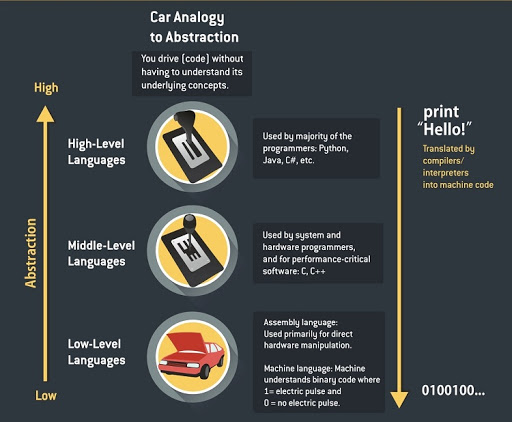

# Object Oriented Programming 

**What is OOP?**

**O**bject-**o**riented **p**rogramming **(OOP)** refers to a type of computer programming (software design) that includes or relies on the concept of classes and objects.
It is used to structure a software program into simple, reusable pieces of code or blueprints (called classes) which are used to create individual instances of objects.

**Why OOP?**
- OOP makes code organised, reusable, and easy to maintain
- Follow the DRY method (Don't Repeat Yourself)
- Prevents unwanted access to data, or exposing proprietary code through encapsulation and abstraction.

**Characteristics of objects**
* Attributes
* Behaviour

**What is a class?**
- In a class, everything is an object 
- Classes form the **blueprint** for objects
- Classes determine how data and behaviours are structured 

**What is an object?**
- An instantiation of a class
- When a class is defined, only the description for the object is defined. Therefore, no memory or storage is allocated.

**What is an instance?**
- Also called an object 
- Objects are **instances** of types.
- 23 is an **instance** of the type *int*
- Instantiation is the creating of a predefined object.
- A realisation of a template (Class of objects)

Example: 

Objects are created for specific instances of a class. You might create an animal class (blueprint) as a standard way to organise all importing information about animals, and then instantiate an individual animal as an object created from the animal class - like a fish.


## Building blocks of OOP
* Classes (blueprint)
* Objects (instances)
* Methods (behaviours)
* Attributes (data)


With a class, we can create sketches of animals with labels. It can contain details about the name, colours and size.
Based on these descriptions, we can study about each animal.

**Example 1: Creating Class and Object in Python**

```python 
class Animal:
    
    # class attribute
    species = "mammal"

    # instance attribute 
    def __init__(self, name, age):
        self.name = name 
        self.age = age

    # instantiate the Animal class
    dog = Animal("Fluffy", 5)
    cat = Animal("Kitty", 12)

    # accessing the class attributes
    print("Fluffy is a {}.format(dog.__class__.species))
    print("Kitty is also a {}.format(cat.__class__.species))

    # accessing the instance attributes
    print("{} is {} years old".format(dog.name, dog.age))
    print("{} is {} years old".format(cat.name, cat.age))
```

Which would give the following output:

```Python
Fluffy is a mammal
Kitty is also a mammal 
Fluffy is 5 years old
Kitty is 12 years old 
```

In the above program, we created a class with the name Animal. Then, we defined the attributes. The attributes are a characteristic of an object. 

These attributes are defined inside the `__init__` method of the class. It is the initialiser method that is first run as soon as the object is created.

Then, we create instances (objects) of the `Animal` class. Here, `cat` and `dog` are references (value) to our new objects. 

We can access the class attribute using `__class__.species`. Class attributes are the same for all instances of a class. Similarly, we access the instance attributes using `dog.name` and `cat.name`. However, instance attributes are different for every instance of a class.


## Methods 

Methods are functions defined inside the body of a class. They are used to define the **behaviours** of an object. 

**Creating methods in Python**

```python 
class Animal:
    # instance attribute 
    def __init__(self, name, age):
        self.name = name 
        self.age = age

    # instance method 
    def sound(self, sound):
        return "A {} makes a {} sound.format(self.name, song)

# instantiate the object
dog = Animal("Fluffy, 5)

# call our instance methods 
print(dog.sound("'Bark'"))
```

The output:

```python 
A dog makes a 'bark' sound
```

In the above program, we define a method `sound()`. These are called instance methods because they are called on an instance object i.e `dog`.

**`def __init__(self):`**
- This is the short form for initialising our class (creating an object)
- By using the `self` keyword we can access the attributes and methods of the class in **python**.
- It **binds** the instance of the class to the **instance** method.
- This represents a constructor in Python
- We know that class is a blueprint for the objects. This blueprint can be used to create multiple numbers of objects. 

**What happens if we do not use `self`**
* EDIT HERE*

**Self can be avoided**

The object (instance) itself is passed along as the first argument, automatically. This implicit behaviour can be avoided while making a **static** method. 

```python 
class A(object):
    @staticmethod
    def stat_meth():
        print("Here, no self was passed")      
```

Here, `@staticmethod` is a function decorator which makes `stat_meth()` static.

The following code instantiates the `A` class and calls the method.

```python
>>> a = A()
>>> a.stat_meth()
Here, no self was passed
```

The implicit behaviour of passing the object as the first argument was avoided while using a static method

## The 4 pillars of OOP

### Inheritance 
- Inheritance is a way of creating a new class for using details of an **existing** class without modifying it. The newly formed class is a derived class (or child class). Similarly, the existing class is a base class(or parent class).

Using Inheritance in Python
```python 
# parent class
class Animal:
    def __init__(self, eat, walk, hungry=True, mood): # Setting default value of hunger to True
        self.eat = eat
        self.walk = walk
        self.hungry = hungry
        self.mood = mood

# child class
class Bird(Animal):
    # using super(), (temporary object of the superclass) allows us to access methods of the base class (parent class)
    def __init__(self):
        super().__init___*(
        print("I am a bird")

    def tweet(self):
        print("tweet tweet")

    def fly(self):
        print("I am a free bird")

pippa = Bird()
pippa.tweet()
```

In the above program, we created two classes i.e. `Animal` (parent class) and `Penguin` (child class). The child class inherits the functions of parent class. 

The child class modified the behaviour of the parent class. We also extended the functions of the parent class, by creating new methods like `tweet()` and `fly()`.

We used the `super()` function inside the `__init__()` method. This allows us to run the `__init__()` method of the parent class inside the child class. 

### Encapsulation 

### Polymorphism
- Poly means many 
- Morph means change 
- Polymorphism refers to the ability of an object taking many forms. 
- Python being an OOP supports Polymorphism through Method overriding and operator overloading. 
- Polymorphism can be achieved through inheritance - Method overriding
- Method overriding provides ability to change the implementation of a method in a child class which is already defined in one of its super class or parent class. 
- If there is a method in a super class the method having the same name number of arguments in a child class is said to be **overriding** the parent class method. 
- We can use the concept of polymorphism while creating class methods as Python allows different classes to have methods with the same name. 
- We can then later generalise calling these methods by disregarding the object we are working with. 

```python
## Example of class polymorphism and inheritance 
from math import pi

class Shape: 
    def __init__(self, name):
        self.name = name

    def area(self):
        pass
    
    def fact(self):
        return "I am a two-dimensional shape."

    def __str__(self):
        return self.name

class Square(Shape):
    def __init__(self, length):
        super().__init__("Square")
        self.length = length
    
    def area(self):
        return self.length**2

    def fact(self):
        return "Squares have each angle equal to 90 degrees."

class Circle(Shape):
    def __init__(self, radius):
        super().init__("Circle")
        self.radius = radius

    def area(self):
        return pi*self.radius**2

a = Square(4)
b = Circle(7)
print(b)
print(b.fact())
print(a.fact())
print(b.area())
```

**Output**

```bash
Circle
I am a two-dimenional shape.
Squares have each angle equal to 90 degrees.
153.93804002589985
```

Methods such as `__str__()`, which have not been overridden in the child classes, are used from the parent class. 

The `fact()` method for object `a(Square class)` is overridden. However, `fact()` method for object `b` has not been overridden. It is *inheriting* from the Parent `Shape` class. 

### Abstraction 
- Abstraction focuses on hiding the internal implementations of a process or method from the user. In this way, the user knows what he is doing but not how the work is being done. 
- Using a car as an analogy. We drive without knowing what is going on underneath. We use the breaks to stop the car but we don't know how the breaks work. 
- Another example is a TV set. We watch films without knowing the inner details of how TV works. 
- In Python, abstraction is achieved by using abstract classes and interfaces.




## Key Points to Remember:
- OOP makes the program easy to understand as well as efficient
- The class is shareable, therefore the code can be reused.
- Data is safe and secure with data abstraction.
- Polymorphism allows the same interface for different objects, so programmers can write efficient code. 

> Exercises for OOP classes [HERE](OOP_class.py)
>
> More exercises for OOP classes [HERE](OOP_class2.py)
>
> Exercises for Inheritance [HERE](OOP_class2.py)
>
> Exercises for Polymorphism [HERE]