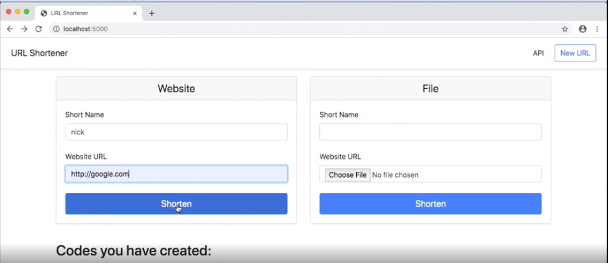

# URL-SHORTENER PROJECT

This was an individual project to create a user friendly page to shorten links e.g www.google.com -> Go

## Imported modules 
```python
from flask import Flask, render_template, request, redirect, url_for, flash, abort, session, jsonify, Blueprint
import json
import os.path
from werkzeug.utils import secure_filename
```

## Building an API with `JSONIFY`
```python
{"go": {"url": "https://www.google.com/"}, "NL-trainee": {"url": "https://www.ing.jobs/netherlands/Traineeships/Traineeblog/blog/Routine-No-thanks.htm"}, "genghis": {"file": "genghisgk.jpg"}, "ya": {"url": "http://yahoo.com"}, "air": {"file": "airIMG_7761.jpg"}, "gogo": {"url": "https://www.google.com/"}, "da_haus": {"file": "da_haushouse67_Cherry_Lane.jpg"}}
```

## Using pytest to validate data 
```python
def test_shorten(client):
    response = client.get('/')
    assert b'Shorten' in response.data
```

## Deploying my first Flask app with Gunicorn (Green Unicorn)
```bash
$ flask run --host=0.0.0.0
$ pipenv install gunicorn
$ gunicorn 'urlshort:create_app()' -b 0.0.0.0
$ sudo apt install nginx
$ systemctl status nginx
$ sudo nano /etc/nginx/sites-enabled/default
$ gunicorn 'urlshort:create_app()' -b 0.0.0.0 --daemon <-- allows app to run even if not running on the terminal 
$ nano urlshort/urlshort.py
```



