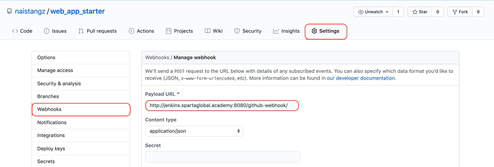
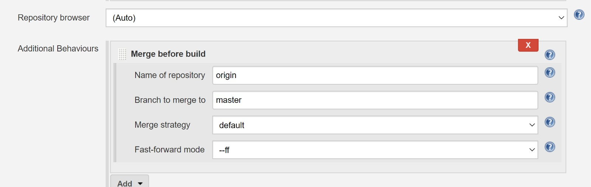
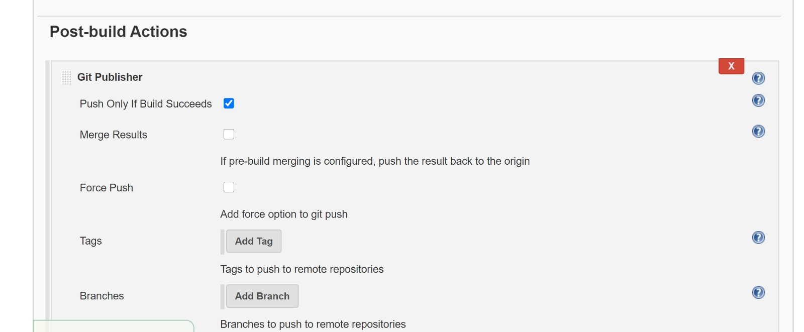

# Jenkins!

## What is Jenkins?
> Extracted from [Here](https://intellipaat.com/blog/tutorial/devops-tutorial/jenkins-tutorial/)
- An automation tool written in Java with built in plugins for continuous integration tasks.
- Used to continuously build and test projects, making it easier to integrate the changing codes to it. 
- Jenkins allows for faster delivery of software by working with a large number of deployment and testing technologies.

## What is an automation server?
- An application that exposes programmable objects to other applications
- Automation servers uses the same commands used by developers to build the software and execute unit tests.
- They are capable of deploying the latest artifact to the production environment 
- Help ease the deployment for testing and staging environments to quickly alert the QA team to the latest changes.

## Why use Jenkins?
- Jenkins practices pipeline-as-a-code concept, that practices automation
- Jenkins can handle both parallel and distributed builds
- Pipelines don't wait for entire process to be completed to look into bugs and errors.
- Jenkins supports thousands of plugins to handle various software, making it highly **extensible**

## Using Github plugin
### Configuring Github
1. Go to your Github repository (e.g web_app_starter) and click on settings
2. Click on Webhooks and click on 'Add webhook'

> Click [here](#what-is-a-webhook) for info on webhooks
3. In the 'Payload URL' field, paste your Jenkins environment URL. At the end of the URL add `/github-webhook/`.
4. In the 'Content type' select 'application/json' and leave the 'Secret' field empty.
5. In the 'Which events would you like to trigger this webhook?' choose 'Just the push event'

### Configuring Jenkins 
6. In Jenkins, click on 'New Item' to create a new project
    
    
7. Give your project a name, then choose 'Freestyle project' and finally click 'OK'.
8. Click on 'Source Code Management' tab
9. Click on Git and paste your Github repository `url` in the 'Repository URL' field.
10. Click on the 'Build Triggers' tab and then on the 'Github hook trigger for GITscm polling'.
11. Click on `apply` and `save`
12. To test changes, create new directories or folders within the repository and commit changes through git.
13. In Jenkins, click on build history, then console output
**which returns**
[Started by an SCM change screenshot here]

## Jenkins integration with GIT (SCM) if plugin not installed 
1. Click on Jenkins
2. Manage Jenkins
3. Manage Plugins
4. Filter git plugin
5. Install Git (available)
6. Once installed, go to the project
7. Configure project 
8. Source Code Management, click on Git

## Using Github Publisher Plugin
Git Publisher Plugin automatically pushing code from other branches to master branch to Github if the tests passes.

## Configuring Jenkins 
1. Name of Project -> Configure -> Source Code Management -> Git. Setup to get the integration branch.
2. Select Merge before build. With details for master branch. 

3. Post Build -> Git Publisher. Check 'push only if build succeeds, and enter details for your master branch".

Jenkins is now configured to merge the integration branch into master if the build succeeds. This assumes that your repository is setup and has a separate branches.\
You can also setup build triggers to trigger the build automatically 

# Recap 
### What is an API?
> Extracted from [smartbear](https://smartbear.com/learn/performance-monitoring/api-endpoints/)
- APIs allow apps to communicate with another-
- Set of procedures and tools for building software applications.
- It is the code that governs the *access point(s)* for the server.

- They allow to go get data from outside sources.
- We can send an API a request detailing the information we want.
- APIs allow our sites to alter data on other applications. E.g. When we click 'share on facebook' or 'share on twitter', the site you are visiting can communicate with your Facebook or Twitter account, and alter its data by adding new status or tweet.
- APIs inform programmers how to interact with the service
- Within public sector, APIs are used to allow agencies to easily share information and also lets the public interact with government as well. 
- Communication channel between your app and the database. 
- Each API has documentation and specifications which determine how information can be transferred.

### Why use an API?
- When accessing another app's data or functionality e.g. all Twitter tweets that mention the #epicodus hashtag, we could ask Twitter for a spreadsheet of all these tweets. **However**, this information becomes **outdated** very quickly. 
- APIs are more efficient to provide us a way to query a company's application to get that data, so that you can view or use it in your own application. 
- It would stay up to date automatically that way.

### API Differs from a "Regular" Database-Backed Project
- API is different from a database backed (or static) web application or site 
- API does not need to contain a frontend - no HTML, CSS is necessary to be shown to the user via static pages or dynamically generated templates that fuse data with reusable layouts.

Requests to retrieve or write data are done by sending an **HTTP** request to a server.

### What is an API call?
- Whenever you make a call to a server using APIs, this counts as an API call.
- Every time you log and ask a question on your computer or an app, you are making an API call.
- The moment you add an endpoint (the URL where your server can be accessed by a client application) to a URL and send a request to a server, you are making a call. 
- With an API call, information is sent and processed back to you.

## What is an API Endpoint?
- One end of a communication channel
- When an API interacts with another system, the touchpoints of this communication are considered endpoints.
- For APIS, an endpoint can include a URL of a server or service.

### What is a Webhook?
- Aka Web callback, 'Reverse APIs', or HTTP push API, is a way for an app to provide other applications with real-time information
- A webhook delivers data to other applications as it happens, meaning you get data immediately
- Unlike APIs where you need to poll (sampling the status of an external device, the continuous checking of other programs to see what state they are in) for data very frequently to get it real-time.
- Webhooks are user-defined HTTP callbacks, meaning if you want to know what is happening in a web service or application, you can give it a URL to let you know when that happens\
E.g Twilio, a developer platform for communications uses webhooks to let your application know when events happen, such as receiving an SMS message or getting an incoming phone call.

- They are triggered by some event in a web applications and can facilitate integrating different applications or third-party APIs

### Webhook vs API
> Extracted from [craftersoftware](https://craftersoftware.com/blog/2019/08/webhooks-vs-apis--whats-the-difference)
- Both help sync and relay data between two applications
- APIs make requests and enabling [CRUD](https://github.com/naistangz/Technical_Training/blob/master/docs/Week4_Python/crud.md) (create, read, update, delete) operations
- This means APIs can not only request data for third-parties, but can manipulate and delete it as well if authorised.
- Webhooks are automated calls to a server
- Webhooks do not require requests to be initiated, data is sent whenever there is new data available
- To set up a webhook, all you have to do is register a URL with the company proving the service you are requesting data from..
- Webhooks receive calls through HTTP POSTs only when the external system you're hooked to has a data update.
- Webhooks listens at URL for incoming HTTP POST notification messages 

API | Webhook
-----|-----
Request-based|Event-based
Useful for know whether external system is online |Useful for real-time updates
Immediately aware if the request was successful because you'll get a response with a status code|Webhooks only communicate if there's an update, so software will be unaware if the other system is offline

SaaS applications use APIs if they want to offer full `CRUD` - create, read, update, and delete - capabilities.

### What is NodeJs
- Not a programming language
- A [runtime environment](#RTE) for JavaScript
- A framework that executes JavaScript code outside a web browser
- Node.js lets developers use JavaScript to write command line tools and for server-side scripting - running scripts server-side to proudce dynamic web page content before the page is sent to the user's web browser.

### RTE
- Stands for Runtime Environment
- As soon as software program is executed, it is in a runtime state
- In this state, program sends instructions to the computer's processor and access the computer's memory (RAM) and other system resources.