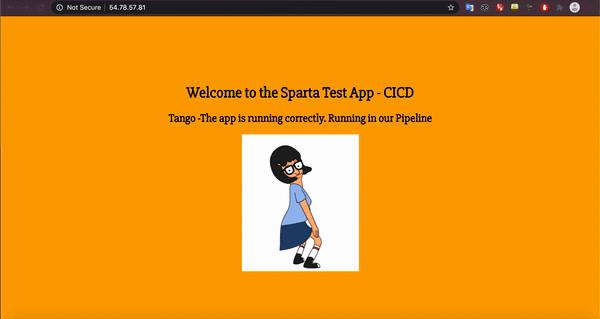

# Working with AWS Networking and Amazon VPC

**Contents**
- [x] [What is a VPC](#what-is-a-vpc)
- [x] [Why use a VPC](#why-use-a-vpc)
- [x] [Subnets](#subnet)
- [x] [Private and Public Subnets](#private-and-public-subnets)
- [x] [Internet Gateway](#igw)
- [x] [Routing Tables](#routing-table)
- [x] [Setting up a VPC](#setting-up-a-vpc)
- [x] [Setting up a Bastion Server](#setting-up-a-bastion-server-a-new-instance)

## What is a VPC?
- Reside inside the AWS Cloud 
- By default, when creating your VPC, the only person that has access to this is your own AWS account.
- It is totally isolated and no one else can gain access to your VPC other than your own AWS account.

## Why use a VPC?
- A Virtual Private Cloud allows you to deploy resources within your VPC, such as:
    - Different compute resources (e.g. CPU and memory) 
    - Storage 
    - Database 
    - Network infrastructure
- This allows you to build and deploy solutions within the Cloud.
- By default you are allowed up to 5 VPCs per region per AWS account
- To create your VPC, you can define an IP address range, in the form of a CIDR block (Classless Inter-Domain Routing)

## Subnet 
- Subnets allow you to segment your VPC infrastructure into multiple different networks
- They reside inside your VPC

## Why create subnets?
- To better manage your resources
- To isolate certain resources from others
- To create high-availability and resiliency within your infrastructure.
- When creating a VPC there are two pieces of information you need:
    - Name
    - [CIDR block address](#cidr-block)

## Private and Public Subnets
- When we create a VPC, we need to give it a CIDR block range
- We need to do the same with our subnets as well
- A **public subnet** is accessible from outside of your VPC e.g the Internet.
- For any resources created within your public subnet e.g. web servers, would be accessible from the Internet
- A **private subnet**, for example your backend databases, would be inaccessible by default from the Internet.
- In order to make a subnet public or private, you have to add an Internet gateway.
- The **main difference** is the **route** the traffic takes out to the Internet - the Internet Gateway of the NAT Gateway.

## IGW
- An Internet Gateway is a managed component by AWS that is attached to your VPC and acts as a gateway between your VPC and the outside world.
- An IGW is a transparent component. It does not have an IP address of its own, and is not a component that you need to manage.
- **Note**: For an EC2 instance to talk to the outside world, instances must be located on a subnet that has a route defined to the IGW, **and** there must be a public IP address (Elastic IP - a reserved public IP address)
- This is **mandatory** to enable **bi-directional** communication between the outside world and the instances. 
- Serves as a bridge between our isolated VPC to the Internet by the IGW which is managed by AWS.
- Before the public subnet can access the Internet, we need to add a route to the public subnet's route table.
- Associated with every subnet when it is created will also be an associated route table.
- You can have the same route table associated to multiple subnets.
- You **cannot** associate more than one route table to a single subnet.

## CIDR block
- The **CIDR block address** is a range of IP addresses and this CIDR block range can have a subnet mask between a range of IP addresses from a `/16` all the way to a `/28`.
- E.g. We create our VPC with the following **CIDR** block `10.0.0.0/16`
- **Note:** Any subnets that we create within our VPC need to reside within this CIDR block range.

## Routing Table 
> Extracted from [Stratoscale](https://www.stratoscale.com/blog/cloud/vpc-for-dummies/)
> AWS Route Tables [Link](https://docs.aws.amazon.com/vpc/latest/userguide/VPC_Route_Tables.html?shortFooter=true)
- Also called the forwarding table.
- The place where routing information is stored 
- A routing table contains routing entries, which is a list of destinations (or a list of network prefixes or routes)
- In AWS, traffic within VPC does not need to be routed.
- A router takes care of this and the entries in this [router](#what-is-a-router) are controlled by you through Route Tables.
- When you want to access a resource outside of your VPC, - you route traffic through your IGW (for public instances) or through the NGW (for private instances).
- The route tables are associated with each of your subnets to allow the flow of traffic according to the policies and options you have in place. 

## What is a router?
- Piece of network hardware that connects a local network to the internet.
- A router forwards data packets between computer networks.
- Routers perform the traffic direction functions on the Internet.
- Data sent through the internet, such as a web page or email, is in the form of data packets.
- A router is connected to two or more data lines from different IP networks. 
- A router directs incoming and outgoing internet traffic on that network in the fastest and most efficient way.


## Setting up a VPC TBC
[Insert GIF instructions]

## Creating an IGW
[Insert GIF instructions]

## Creating Public and Private Subnets
[Insert GIF instructions]

## Creating a route table TBC
[Insert GIF instructions]

## Security Group Rules - NACLs
[Insert GIF instructions]

## Testing using Mac Terminal
1. Connect to the EC2 Instance with VPC
2. In terminal, `ssh` into the instance by typing in the following command:
```bash
ssh -i "DevOpsStudents.pem" ubuntu@34.245.71.30
```
3. Install web server `nginx`
```bash
sudo apt-get install nginx
```

4. Type in the following IP into the browser to verify that `nginx` has been installed successfully:
```bash
34.245.71.30
```

## Setting up a Bastion Server (a new instance)
- Create New Instance (Bastion Server)
- Create new security group
- Allow SSH on port 22 from this IP address.
    - This means that any instances associated to this security group allow inbound SSH from any resource sitting within this security group, which is associated to our bastion host.
    - This will allow the bastion host SSH access to these instances.
- Securely copy private key into Bastion instance using the following command:
```bash
scp -i ~/.ssh/DevOpsStudents.pem DevOpsStudents.pem ubuntu@52.19.173.136:/home/ubuntu/.ssh
```
- `ssh into bastion with bastion public ip` using private key. The connection will come through the IGW (internet gateway).
- `ssh into db instance with private ip` to access our private subnet.

1. cd AWSNodeAPPipeline
2. Enter following to link files in OS to app 
```bash
scp -i ~/.ssh/DevOpsStudents.pem -r ~/PycharmProjects/AWSNodeAppPipeline/environment/app/ ubuntu@54.78.57.81:/home/ubuntu/environment
```
3. SSH into App on VPC:
```bash
ssh -i "DevOpsStudents.pem" ubuntu@54.78.57.81
```
4. Run the `provision.sh` file in `environment/app` to install all packages:
```bash
provision.sh
```
5. Cd into app to run `app.js`
```bash
cd ~/app
pm2 start app.js
```

6. Enter the IP address into the browser (with reverse proxy working correctly) to see the app working:
```bash
54.78.57.81
```

