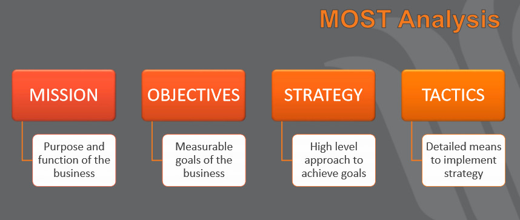
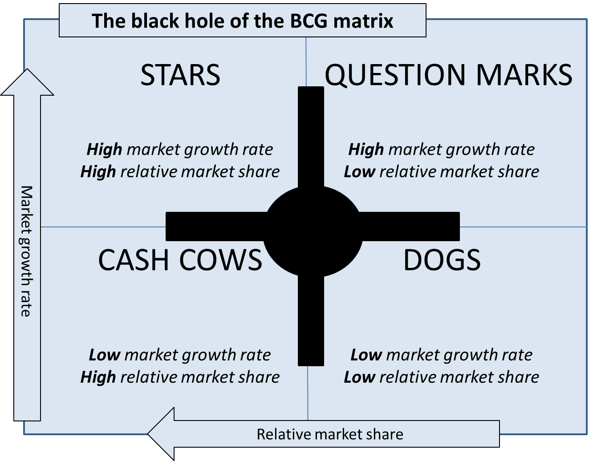
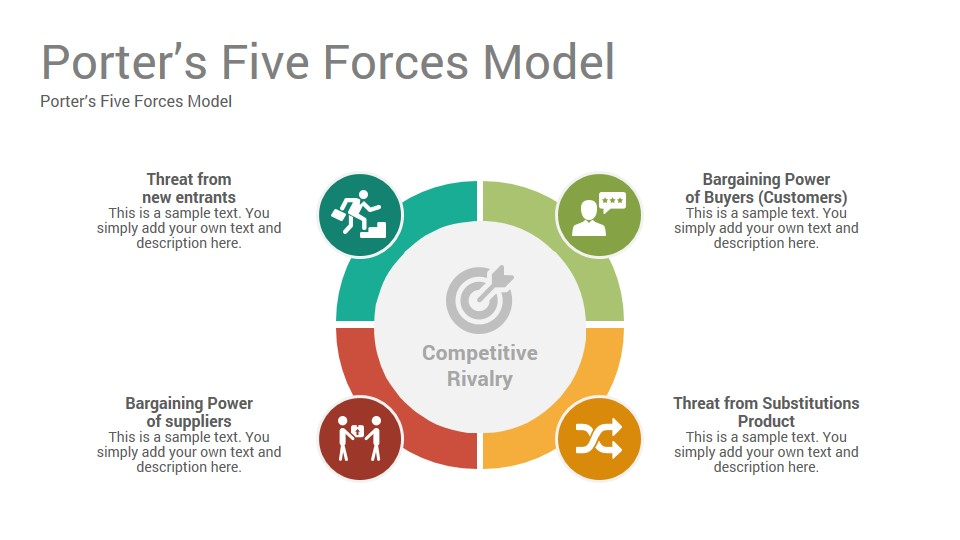
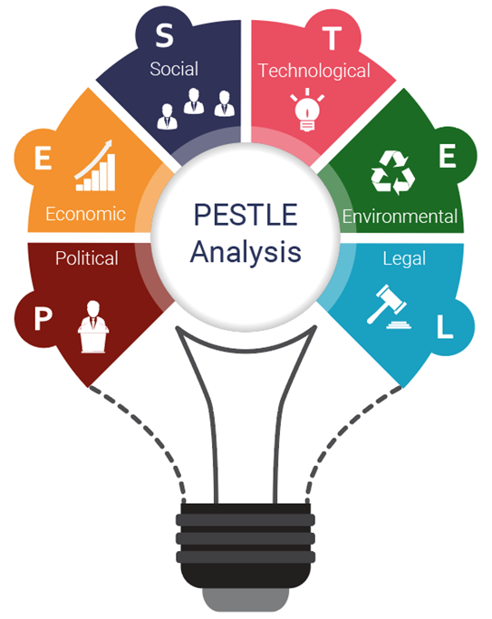

# Week 1.5 

## Strategy Analysis 

### **MOST** 
> * M - Mission 
> * O - Objectives
> * S - Strategy
> * T - Tactics
>
MOST analysis is used to improve internal processes and company culture by analysing the organisation’s internal environment. 
>
**Mission**
> This declares the purposes as a company and serves as the standard against which to weigh a company's actions and decisions

**Objectives**
> This seeks to understand what the important goals that will help achieve the mission

**Strategy**
>The approaches in which the objectives can be achieved

**Tactics**
> They define how the strategies are going to be implemented at the lowest level

---
### **Boston Box** ###
Also known as Growth-Share-Matrix, it is a **tool** for portfolio management.
The idea is to develop a balanced portfolio of products or business units that generate or consume cash.
The products and business units are divided into four quadrants:
* Wild cat - **Build** - New entrants (Low market share, but high market growth) 
* Star - **Hold** - Potential for growth (High market share, and high market growth)
* Cash cow - **Milk/Harvest** - Matured (High market share, but low market growth) 
* Dog - **Divest** - On the declining path (Low market share, and low market growth)

---
### **Porter's Five Forces** ###
This is a tool to understand the competitiveness of your business environment, and for identifying a company's strategy's potential profitability. 

Created by Harvard Business School professor Michael Porter, he identified five forces that make up the competitive environment that could impact the business, and which can erode your profitability. These are:

1. **Competitive Rivalry**
- The number and strength of competitors. Where rivalry is intense, companies can attract customers with aggressive price cuts and high-impact marketing campaigns. 
- With lots of rivals, your suppliers and buyers can go elsewhere if they feel that they're not getting a good deal
- Where rivalry is minimal, you are likely to have tremendous strength and healthy profits.

Example: Numerous airlines compete for every route. Since differentiation is low and fixed costs are high, there is constant pressure for price competition, and to match improvements in technology, cabin features, and customer service.

2. **Supplier Power**
- This force analyses how much power and control a company's supplier has over the potential to raise its price or to reduce the quality of purchased goods or services, which would lower an industry's profitability potential. 
- Businesses are in a better position when there are a multitude of suppliers.
- The presence of available substitutes, the strength of their distribution channels and the uniqueness or level of differentiation in the product or service the supplier is delivering.

Example: The bargaining power of suppliers in the airline industry can be considered high. Airline companies are dependent on fuel and aircrafts. 

These inputs are affected by external environment over which airline companies have little control, for example, the price of aviation fuel is subject to the fluctuations in the global market for oil, which can change according to geopolitical and other factors.
However, in terms of aircraft, only two major suppliers exist:
 
> **Boeing and Airbus.**

Boeing and Airbus therefore have substantial bargaining power on the prices they charge.

3. **Threat of substitute products**
- Existence of products outside increases propensity of customers to consider alternatives
Example: energy drink like Redbull is not considered a competitor of coffee brands such as Starbucks or Nespresso. 

However, since both coffee and energy drink fulfill a similar need (i.e. staying awake/getting energy), customers might be willing 
to switch from one to another if they feel that prices increase too much in either coffee or energy drinks. This will ultimately affect an industry's profitability. 

4. **Buyer Power**
- Powerful customers can use their cloud to force prices down or demand more service at existing prices, thus capturing value for themselves.
- Buyer power is highest when buyers are large relative to the competitors serving them.

Example: Airlines have a hard time differentiating themselves and creating customer loyalty, switching costs for buyers are nearly non-existent, and rise of budget airlines undermines price levels.

5. **Threat of New Entry**
- The threat of new competitors into an industry can force current players to keep prices down and spend more to retain customers.
- New entrants can place a cap on the profit potential of an industry.
- This threat depends on the size of a series of barriers to entry, including economies of scale, to the cost of building brand awareness. 
- This threat also depends on capabilities of likely potential entrants. If there are well established companies in the industry operating in other geographic regions, the threat of entry rises.

Example: The airline industry continues to grow. The cost of entry is low with ready access to aircraft and financing, availability of skilled personnel, and access to gates. New airlines often have advantages due to less seniority of personnel, which lowers wages, and newer aircraft with greater fuel efficiency. 

---
### **PESTLE**
**What is PESTLE?**

* A framework or tool to analyse and monitor the macro-environmental factors that may have an impact on an organisation's performance.
* This tool can be especially useful when starting a new business or entering a foreign market.
> * **Political** -> the degree to which a government intervenes e.g. policies, political stability, foreign trade policy, infrastructure.
> * **Economic** -> determinants of a certain economy's performance e.g. exchange rates, inflation rates, interest rates, disposable income of consumers.
> * **Social** -> the demographic characteristics, norms, customs and values of the population within which the organisation operates e.g population growth rate, age distribution, income distribution, career attitudes
> * **Technological** -> the innovations in technology that may affect the operations of the industry and the market favourably or unfavourably e.g technology incentives, the level of innovation, automation, research and development (R&D) activity, tech change and tech awareness that a market possesses
> * **Environmental** -> they have become important due to increasing scarcity of raw materials, pollution targets and carbon footprint targets set by the government e.g weather, climate environmental offsets and climate change which may affect industries such as tourism, farming, agriculture and insurance
> * **Legal** -> may have overlap with political factors but also include specific laws such as discrimination laws, antitrust laws, employment laws, consumer protection laws, copyright and patent laws. Companies need to know what is and what is not legal in order trade successfully and ethically
 

---
### **SWOT**

> * **Strengths**:characteristics of the business or project that give it an advantage over others.
> * **Weaknesses**: characteristics of the business that place the business or project at a disadvantage relative to others.
> * **Opportunities**: elements in the environment that the business or project could exploit to its advantage.
> * **Threats**: elements in the environment that could cause trouble for the business or project.

**What is a SWOT analysis?**
SWOT is a strategic planning technique used to help a person or organisation identify strengths, weaknesses, opportunities, and threats related to business competitions or project planning.

 

